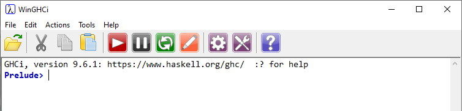

# WinGHCi and GHC setup

One of the modules in the Computer Science course in the school in which I work needs GHC (the Glasgow Haskell Compiler). In the past, Haskell Platform has been used to support this requirement, however that was deprecated in 2022.

The majority of the module uses [WinGHCi](https://github.com/haskell/winghci) (a simple Windows GUI for GHCi), however at the time of writing, this has not been modified in 14 years, and no recent builds are provided.

This page will provide information on getting WinGHCi compiled using Visual Studio 2022, along with scripts to allow the deployment of the required Haskell components, either using PowerShell, or Microsoft Endpoint Configuration Manager (MECM/SCCM), and required configuration of the target computer.

Here's WinGHCi compiled as detailed below running on a Windows 10 virtual machine:



We use MECM to deploy the required components, however the scripts can be used to manually deploy the software, and there are notes where required to help guide.

## Preparation

If you just want to get installing and are happy to use the provided compiled version of WinGHCi, navigate to [Installation](#Installation).

If you want to compile WinGHCi yourself, you will need the following:
* A copy of Visual Studio 2022 - [Visual Studio Community](https://visualstudio.microsoft.com/vs/community) is fine for these purposes. I have mine configured in a Windows 10 virtual machine for ease. When setting up Visual Studio, add the 'Desktop development with C++' workload and ensure that the 'C++ MFC for latest v143 build tools (x86 & x64)' (or the latest at the point you install it) optional component for this workload is selected to be installed. If this workload with this component is not added, WinGHCi will not compile.
* A copy of the WinGHCi source. This is contained in this repo upgraded to be ready for use with Visual Studio 2022. If you want to pull the original source and upgrade it yourself, grab a copy of the code from [WinGHCi](https://github.com/haskell/winghci). Delete the 'winghciInstaller' folder if you use the original source as this is not supported, and a PowerShell script is provided to perform the same actions.

## Compiling WinGHCi

The process to compile WinGHCi is fairly straightforward:
1. Ensure that Visual Studio 2022 is installed with the correct workload mentioned above. Open Visual Studio to ensure that it fires up properly.
2. Double-click on the 'winghci.sln' file in the code. If using the original source, you'll have to step through the upgrade process. You'll be guided through this by Visual Studio.
3. Click 'Build' -> 'Build Solution' from Visual Studio's menu.
4. Wait for the build to complete. This will only take a few seconds. The output files will be in the '\Release' folder once the build is complete.

## Installation

Ensure that you have gathered all of the items you'll need:
* The compiled WinGHCi application. You'll need StartGHCi.exe, StartProcess.exe and winghci.exe.
* The scripts in the Scripts folder.
* The icon files (in \winghci\Resources in the original repo).

All of the above items are provided, either in the release, in the scripts folder, or in the assets folder.

Installation instructions:
1. Unpack the release or assemble the required files. My setup looks like:
```
C:\Support\Haskell
|   haskelllogo.png (used for MECM)
|
+---9.6.1 (target version at the time of writing)
    |   InstallorUpgradeHaskell.ps1
    |   MECMDetection.ps1 (used for MECM)
    |
    \---WinGHCi
            StartGHCi.exe
            StartProcess.exe
            winghci.exe
            winghci.ico (optional)
            winghciFile.ico (used for file association on the target system)
```
2. Ensure that target systems have internet access to download the various Chocolatey components.
3. If manually installing Haskell on a computer:
    1. Copy the files assembed as above to an appropriate location on that computer.
    2. Ensure that the command 'Set-ExecutionPolicy Unrestricted' has been run on the computer as an admin.
    3. Run PowerShell as an admin, change to the location of the screipt.
    4. Run the 'InstallorUpgradeHaskell.ps1 script.
    5. Wait for installation to complete.
    6. Perform required tests to ensure everything is working as expected.
4. If installing Haskell using MECM:
    1. Copy the files assembled as above to your application source location on your network/MECM server.
    2. Create a new application, use the following command line to perform the installation:
    Powershell.exe -ExecutionPolicy ByPass -File "InstallOrUpgradeHaskell.ps1"
    3. Use the contents of the MECMDetection.ps1 script as a custom PowerShell detection script. This looks for both GHCi.exe and WinGHCi.exe files to confirm that installation is complete. This could be extended to also check for Haskell-Stack, if required. If you prefer, you can do a simple file detection for either GHCi.exe or WinGHCi.exe (or both), but you'd have to make an assumption about the version of GHC that's going to get installed in your detection, whereas the MECMDetection.ps1 script looks for the installed version of GHC and does the detection in the bin folder in that installation.
    4. Perform a test installation to a target computer.
    5. Perform required tests to ensure that everything is working as expected.
    6. Roll the solution out to all required computers.

Remember: If running the installation scripts manually you need to run 'Set-ExecutionPolicy Unrestricted' beforehand.

The script 'FileAssociation.ps1' is also included in case you need to move the WinGHCi location following installation. If this happens, run FileAssociation.ps1 from the new folder containing WinGHCi.exe to re-register the file associations.
